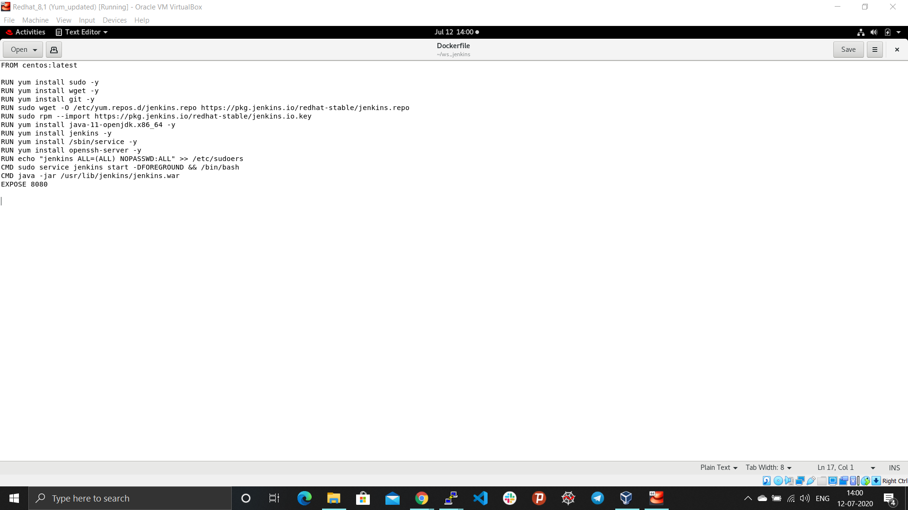

## Intergration of Jenkins, Docker and Github
*This project has been created to deploy a docker container using Dockerfile. The deployed container has pre-installed and configured Jenkins, Git, Java and all the required packages(.rpm).*

### Problem Statement:
```
1. Create container image that’s has Jenkins installed  using dockerfile 
2. When we launch this image, it should automatically starts Jenkins service in the container.
3. Create a job chain of job1, job2, job3 and  job4 using build pipeline plugin in Jenkins 
4. Job1 : Pull  the Github repo automatically when some developers push repo to Github.
5. Job2 : By looking at the code or program file, Jenkins should automatically start the respective language interpreter install image container to deploy code ( eg. If code is of  PHP, then Jenkins should start the container that has PHP already installed ).
6. Job3 : Test your app if it  is working or not.
7. Job4 : if app is not working , then send email to developer with error messages.
8. Create One extra job job5 for monitor : If container where app is running. fails due to any reson then this job should automatically start the container again.
```

### Prerequisite:

System has to pre-configured with docker, Jenkins, Git.

### Detail setup of the environment:

- Create a Dockerfile in the separate directory to setup the container environment

```
FROM centos:latest

RUN yum install sudo -y
RUN yum install wget -y
RUN yum install git -y
RUN sudo wget -O /etc/yum.repos.d/jenkins.repo https://pkg.jenkins.io/redhat-stable/jenkins.repo
RUN sudo rpm --import https://pkg.jenkins.io/redhat-stable/jenkins.io.key
RUN yum install java-11-openjdk.x86_64 -y
RUN yum install jenkins -y
RUN yum install /sbin/service -y
RUN yum install openssh-server -y
RUN echo "jenkins ALL=(ALL) NOPASSWD:ALL" >> /etc/sudoers
CMD sudo service jenkins start -DFOREGROUND && /bin/bash
CMD java -jar /usr/lib/jenkins/jenkins.war
EXPOSE 8080
```
To create the custom image, run the following command from the directory containing Dockerfile

- To provide tag to the image use -t
- Jenkins:v1, Jenkins is the image name and v1 is the version of the image
- Dot(.) represent the current working directory
```
docker build -t Jenkins:v1 .
```

After creating the image launch the container from the custom image, Jenkins:v1
- To run the container in the detached mode with interactive terminal use (-dit)
- 8082 is the exposed port to achieve NAT and 8080 is the port where jenkins is running inside the container, (-p) to specify port
- (--name) to provide name to the container
- Jenkins:v1 is the created custom image
```
docker run -dit -p 8082:8080 --name my_jenkins Jenkins:v1
```

Now, as one launches the jenkins running inside the container at port 8082, it requires password to login to the Jenkins dashboard
```
docker exec -it my_jenkins bash
cat /root/.jenkins/secrets/initialAdminPassword
```
Login to the Jenkins dashboard and change the admin password as per the requirement.

Now, install some required plugins to achieve the task from **manage jenkins -> manage plugins**
- Github
- SSH
- Build Pipeline

**Job1:** This job will download the code as soon as developer commit the code in the github repository. To achieve this set the webhook to the github repository.


To trigger the code commit done by the developer, we used ngrok program
```
./ngrok http 8082
```


- Configuration of the Job1 in the jenkins:


```
sudo cd /
if sudo ls -a | grep /jen_data
then
	sudo rm -f /jen_data
	sudo mkdir /jen_data
fi

sudo cp -rvf *.html /jen_data
sudo cp -rvf *.php /jen_data
```

**Job2:** This job will launch the conatiner by analysing the file according to the extension(seperate container for .html and .php file). 
- Configuration of the Job2 in the jenkins:


```
sudo cd /jen_data

if sudo ls | grep .html
then
	if sudo docker ps -a | grep httpd_con
	then
		sudo docker rm -f httpd_con
		sudo docker pull httpd
		sudo docker run -dit -p 8084:80 -v /jen_data:/usr/local/apache2/htdocs/ --name httpd_con httpd
	fi
fi

if sudo ls | grep .php
then
	if sudo docker ps -a | grep php_con
	then
		sudo docker rm -f php_con
		sudo docker pull vimal13/apache-webserver-php
		sudo docker run -dit -p 8085:80 -v /jen_data:/var/www/html --name php_con vimal13/apache-webserver-php
	fi
fi
```

**Job3:** This job will identify whether the deployed website is running fine or not. If any error occured then it will mail the recipient e-mail address.
- Configuration of the Job3 in the jenkins:


```
if sudo docker ps | grep httpd_con
then
	if [[ $(curl -s -o /dev/null -s -w “%{http_code}” https://192.168.99.102:8084/web.html) == 200 ]]
	then
		echo "website running successfully."
		exit 0
	else
		echo "Deployment not successful."
		exit 1
	fi
fi

if sudo docker ps | grep php_con
then
	if [[ $(curl -s -o /dev/null -s -w “%{http_code}” https://192.168.99.102:8085/web.php) == 200 ]]
	then
		echo "website running successfully."
		exit 0
	else
		echo "Deployment not successful."
		exit 1
	fi
fi
```

- Configuration of the mail in the jenkins:


**Job4:** This job will monitor the running container periodically and if any error occurs with container, it will automatically launch the configured container.
- Configuration of the job4 in the jenkins:


```
sudo cd /jen_data

if sudo ls | grep .html
then
	if sudo docker ps -a | grep httpd_con
    then
    	exit 0
	else
		docker run -dit -p 8084:80 -v /jen_data:/usr/local/apache2/htdocs/ --name httpd_con httpd
	fi
fi

if sudo ls | grep .php
then
	if sudo docker ps -a | grep php_con
    then
    	exit 0
	else
		docker run -dit -p 8085:80 -v /jen_data:/var/www/html --name php_con vimal13/apache-webserver-php
	fi
fi
```

### Pipeline view of the created Jobs related to the project:


